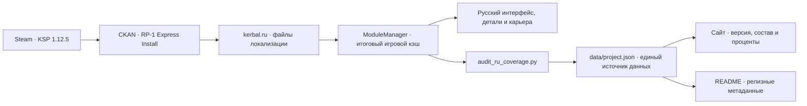

# kerbal.ru

**Русская локализация Realism Overhaul · Real Solar System · RP-1 для Kerbal Space Program 1.12.5**

[](https://kerbal.ru)
[](https://github.com/plagness/kerbal.ru/releases/latest)
[](https://github.com/plagness/kerbal.ru/actions)
[](https://github.com/plagness/kerbal.ru/discussions)

> Реальная космонавтика. Честный перевод. Открытое сообщество.
>
> Устанавливается поверх лицензионной KSP и сборки из CKAN. Оригинальные файлы модов не изменяются.

[Сайт](https://kerbal.ru) · [Установка](#установка) · [Обновление](#как-обновляться) · [Покрытие](docs/COVERAGE.md) · [Roadmap](docs/ROADMAP.md) · [Участие](CONTRIBUTING.md)

---

## Зачем существует kerbal.ru

RO/RSS/RP-1 превращает KSP в серьёзный симулятор реальной космонавтики: настоящая Земля, исторические двигатели, сложная орбитальная механика и длинная карьера. kerbal.ru делает эту сборку понятнее русскоязычным игрокам и собирает переводы в одном месте.

Это не репак и не отдельная сборка игры. Репозиторий содержит только добавочные файлы локализации, установщики, инструменты аудита и сайт проекта. Сама KSP и моды устанавливаются легально через Steam и CKAN.

## Состояние проекта

<!-- project-data:start -->
| Что измеряем | Сейчас | Источник |
|---|---:|---|
| Версия русификатора | **[v26.3](https://github.com/plagness/kerbal.ru/releases/tag/v26.3)** | `data/project.json` |
| Поддерживаемые нами моды | **20** | Собственные `ru.cfg` и MM-патчи |
| Состав с русским блоком | **38 / 83 · 45,8%** | Полная инвентаризация `GameData` |
| Проверено деталей | **1 023** | `ModuleManager.ConfigCache` |
| Названия деталей | **56,8% · 581/1023** | Подтверждено игровым кэшем |
| Описания деталей | **71,7% · 733/1023** | Подтверждено игровым кэшем |
| Производители | **13,9% · 142/1023** | Подтверждено игровым кэшем |

> Активные показатели: **подтверждено игровым кэшем** от 2026-07-23. Последняя подтверждённая кэшем база: **56,8% названий / 71,7% описаний / 13,9% производителей**. [Методика и таблица по модам →](docs/COVERAGE.md)
<!-- project-data:end -->

## Установка

Сначала установи лицензионную **Kerbal Space Program 1.12.5** и сборку `RP-1-ExpressInstall` через [CKAN](https://github.com/KSP-CKAN/CKAN/releases/latest).

### Linux · macOS · Steam Deck

```bash
curl -fsSL https://kerbal.ru/install-ru.sh | bash
```

### Windows · PowerShell

```powershell
irm https://kerbal.ru/install-ru.ps1 | iex
```

Установщик найдёт KSP, скачает последний стабильный релиз, сделает резервную копию заменяемых файлов, скопирует локализацию и включит русский язык. Скрипты открыты: перед запуском их можно [прочитать для Unix](install-ru.sh) или [для Windows](install-ru.ps1). Ручной способ и инструкции по каждой ОС — в [быстром старте](docs/QUICKSTART.md).

## Как обновляться

Когда выходит следующий релиз, достаточно повторить ту же команду установки. Установщик:

1. сравнит установленную версию с последним GitHub Release;
2. сохранит заменяемые файлы в `Kerbal Space Program/kerbal.ru-backups/`;
3. удалит только устаревшие файлы, которыми раньше управлял kerbal.ru;
4. установит новые переводы и запишет версию в `.kerbalru-version`.

Моды, сохранения и любые посторонние файлы в `GameData` не удаляются. Проверить наличие обновления можно без установки:

```bash
curl -fsSL https://kerbal.ru/install-ru.sh | bash -s -- --check
```

```powershell
& ([scriptblock]::Create((irm https://kerbal.ru/install-ru.ps1))) -Check
```

Можно установить конкретный релиз для воспроизводимой сборки или отката: `--version v26.1` в Unix и `-Version v26.1` в PowerShell. Полный сценарий обновления, каналы `stable`/`main` и восстановление из резервной копии описаны в [docs/UPDATING.md](docs/UPDATING.md).

## Как всё связано



## Где помочь

Проект строится вокруг небольших, проверяемых вкладов. Не обязательно уметь программировать.

| Направление | Хорошая первая задача |
|---|---|
| Перевод | Взять один из [17 кандидатов](docs/COVERAGE.md#3b-реальные-кандидаты-для-перевода-есть-деталиui--17) и перевести небольшой блок строк |
| Проверка в игре | Пересобрать `ModuleManager.ConfigCache`, запустить аудит и приложить результат |
| Терминология | Проверить названия двигателей, ступеней и космических программ |
| Установщики | Проверить обновление на Windows, Linux, macOS или Steam Deck |
| Сайт | Улучшить доступность, производительность и мобильное отображение |
| Документация | Дополнить FAQ, инструкции или разбор типичной ошибки |

Начни с [CONTRIBUTING.md](CONTRIBUTING.md), предложи идею в [Discussions](https://github.com/plagness/kerbal.ru/discussions) или выбери [открытую задачу](https://github.com/plagness/kerbal.ru/issues). Для первого PR особенно полезны задачи с метками `good first issue` и `help wanted`.

## Устройство репозитория

```text
GameData/                  готовые файлы локализации для установки в KSP
assets/                    открытые текстуры и 3D-модель для сайта
data/project.json          версия, состав и показатели перевода
docs/                      установка, покрытие, roadmap и сопровождение
tools/audit_ru_coverage.py аудит реального игрового кэша
tools/sync_project_data.py проверка и синхронизация данных проекта
tools/bump_release.py      следующий релиз формата vYY.N
install-ru.sh              установщик и обновлятор Unix-систем
install-ru.ps1             установщик и обновлятор Windows
index.html                 kerbal.ru — статический сайт на Three.js
.github/                   шаблоны сообщества и автоматические проверки
```

Технические правила переводов, устройство `ru.cfg` и ModuleManager-патчей описаны в [MAINTAINING.md](docs/MAINTAINING.md).

## Принципы

- **Честные цифры.** Проверяем итоговый игровой кэш, а не только наличие файлов.
- **Не ломать оригиналы.** Добавляем локализацию поверх модов и не перепаковываем игру.
- **Реальная терминология.** Апогей, перигей, тяга, сопло — язык реальной космонавтики.
- **Воспроизводимые релизы.** Версия перевода фиксируется, обновление можно проверить и откатить.
- **Открытое участие.** Решения обсуждаются публично, вклад принимается через pull request.

## Документы проекта

- [Быстрый старт](docs/QUICKSTART.md) — установка для игрока.
- [Обновление и откат](docs/UPDATING.md) — переход между релизами.
- [Покрытие](docs/COVERAGE.md) — фактические цифры и инвентаризация сборки.
- [Roadmap](docs/ROADMAP.md) — планы и приоритеты.
- [История изменений](CHANGELOG.md) — содержимое стабильных релизов.
- [Сопровождение](docs/MAINTAINING.md) — правила переводов и проверки.
- [Инструкция для ИИ-агентов](AGENTS.md) — безопасная установка и post-install сценарий.
- [Участие](CONTRIBUTING.md) — путь от идеи до pull request.
- [Управление проектом](GOVERNANCE.md) — роли и принятие решений.
- [Поддержка](SUPPORT.md) · [Безопасность](SECURITY.md) · [Кодекс поведения](CODE_OF_CONDUCT.md).

## Лицензии и благодарности

kerbal.ru — независимый фанатский проект и не аффилирован со Squad, Private Division, Take-Two или авторами модов. Для игры нужна легальная копия KSP.

Переводы опираются на строки соответствующих модов и сохраняют их лицензионные условия. Оригинальный код и документация kerbal.ru распространяются по MIT; точная разбивка сторонних материалов приведена в [LICENSE.md](LICENSE.md). Планетарные текстуры и модель Saturn V получены из открытых ресурсов NASA/JPL; иконки сайта — [Tabler Icons](https://tabler.io/icons) (MIT).

---

**От первого спутника до Марса — теперь по-русски.**

[Открыть kerbal.ru](https://kerbal.ru) · [Присоединиться к сообществу](https://github.com/plagness/kerbal.ru/discussions)
