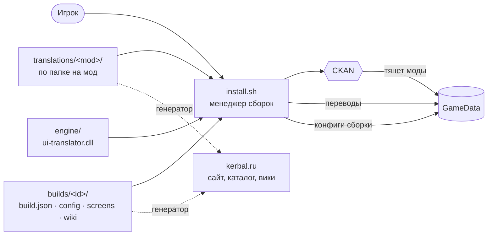
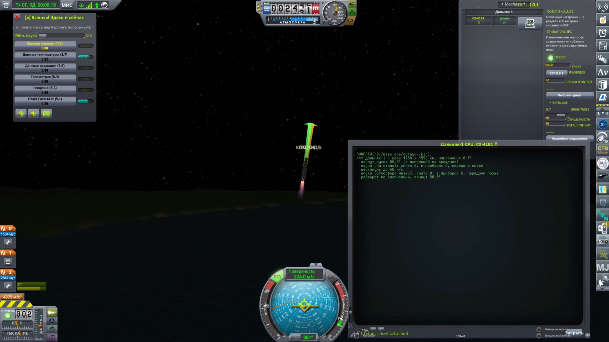

<div align="center">

# kerbal.ru — русский хаб KSP-моддинга

**Библиотека переводов модов + каталог готовых русских сборок с установщиком.**
Kerbal Space Program 1.12.5.

[](https://kerbal.ru)
[](https://github.com/plagness/kerbal.ru/releases)
[](https://github.com/plagness/kerbal.ru/stargazers)
[](https://github.com/plagness/kerbal.ru/releases)
[](docs/COVERAGE.md)
[](https://kerbal.ru/Operator/wiki/)

[Сборки](#каталог-сборок) · [Установка](#быстрый-старт) · [Переводы](#библиотека-переводов) ·
[kOS](#скрипты-полёта) · [Вики](https://kerbal.ru/Operator/wiki/) · [Участие](.github/CONTRIBUTING.md)

</div>

---

## Что это

Две вещи, которые работают вместе, но полезны и по отдельности:

1. **Библиотека переводов** (`translations/`) — русификация модов KSP **по одной папке на мод**.
   Нужен перевод конкретного мода — берёшь его папку и кладёшь в `GameData`. Всё.
2. **Каталог сборок** (`builds/` + `install.sh`) — выбираешь готовую русскую сборку, и она ставится
   в пару команд: официальный CKAN тянет моды, поверх ложатся наши переводы, включается русский.

Мы **не храним и не раздаём чужие моды** — только свои дескрипторы сборок и переводы.
Моды всегда ставит официальный **CKAN**. Ассеты игры не извлекаем и не публикуем.


```mermaid
flowchart LR
  U([Игрок]) --> I[install.sh<br/>менеджер сборок]
  I --> C{{CKAN}}
  C -->|тянет моды| G[(GameData)]
  I -->|переводы| G
  I -->|конфиги сборки| G

  T[translations/&lt;mod&gt;/<br/>по папке на мод] --> I
  B[builds/&lt;id&gt;/<br/>build.json · config · screens · wiki] --> I
  E[engine/<br/>ui-translator.dll] --> I

  T -.генератор.-> S[kerbal.ru<br/>сайт, каталог, вики]
  B -.генератор.-> S
```

Переводы переживают сборки: мод убрали из каталога — его папка в `translations/` остаётся.
Кому-то она пригодится отдельно.

---

## Быстрый старт

```bash
# выбрать сборку интерактивно (меню)
curl -fsSL https://kerbal.ru/install.sh | bash

# или сразу конкретную
curl -fsSL https://kerbal.ru/install.sh | bash -s -- --build operator

curl -fsSL https://kerbal.ru/install.sh | bash -s -- --list        # каталог сборок
```

Установщик — **менеджер сборок**: при повторном запуске находит уже стоящую сборку и предлагает
**обновить / сменить / только переводы**. Состояние — в `<KSP>/.kerbalru-build.json`.
Флаги: `--build <id>` · `--update` · `--ru-only` · `--list` · `--yes`.

**Windows** — без терминала: `.ckan`-метапакет и ZIP-архив из [релизов](https://github.com/plagness/kerbal.ru/releases).
Подробно — [QUICKSTART.md](docs/QUICKSTART.md), обновление — [UPDATING.md](docs/UPDATING.md).

---

## Каталог сборок

| Сборка | Что это | Система | Модов | Сложность |
|---|---|---|---|---|
| **[«Оператор»](builds/operator/)** — курируемая | Спутники → сеть покрытия → орбитальные станции → автоматика на kOS. «Ванила+» для долгой игры | сток | 60 | 2/5 |
| **[RO / RSS / RP-1](https://kerbal.ru/KSP-RO)** — зеркало | Реальная Солнечная система, реальная физика, историческая карьера с 1951 года | RSS | — | 5/5 |

У «Оператора» есть собственная [вики](https://kerbal.ru/Operator/wiki/) — 50 статей: связь и CommNet,
частоты наземных станций, диагностика, наука, kOS, подключение ИИ-агентов, разбор реальных инцидентов в игре.

### Как это выглядит

[](builds/operator/screens/README.md)

Все кадры с подписями — [builds/operator/screens/](builds/operator/screens/README.md).

---

## Библиотека переводов

Три метода, выбираются по тому, где мод хранит текст:

| Метод | Когда | Что кладём |
|---|---|---|
| `keyed` | мод поддерживает `#LOC`-ключи | `Localization/ru.cfg` |
| `mm-title` | текст в конфигах деталей | ModuleManager-патч `:FINAL` |
| `ui-dict` | текст зашит в DLL | словарь `Англ⇥Рус` + Harmony-движок |

Перевод отсутствующего мода — безопасный no-op. Localization-патчи ложатся в
`GameData/zzz-kerbalru-translations/<mod>/`: префикс `zzz-` гарантирует применение
после Realism Overhaul, чтобы наши `:FINAL`-переводы заголовков выигрывали.

Взять перевод одного мода: скопируй `translations/<mod>/` в свой `GameData/`
(для хардкод-модов нужен ещё `engine/Plugins/KerbalRuUiTranslator.dll`) и выставь `LANGUAGE = ru`.

Полная раскладка охвата — [COVERAGE.md](docs/COVERAGE.md), правила перевода — [MAINTAINING.md](docs/MAINTAINING.md),
устройство ui-движка — [UI-TRANSLATION.md](docs/UI-TRANSLATION.md).

---

## Скрипты полёта

`kos/` — открытая библиотека блоков для kOS: подъём, узлы манёвра, наука, телеметрия, индикация.
Файл миссии содержит только цель и порядок шагов — всё остальное считается:

```kos
RUNONCEPATH("0:/lib/mission.ks").
SET s TO m_defaults().
SET s["ap"]  TO 7867078.    // апоцентр, м
SET s["pe"]  TO 3331362.    // перицентр, м
SET s["inc"] TO 20.1.       // наклонение
m_orbit(s).                 // дальше само
```

Установщик кладёт библиотеку прямо в игру — в `Ships/Script/`, где её видит kOS, — а рядом
с игрой оставляет вики и `AGENTS.md`: инструкцию для ИИ-агента, если игрок посадит агента
помогать с миссиями. Обновляется отдельно от модов: `install.sh --docs`.

Всё проверено в живых полётах, включая грабли (левосторонняя система координат KSP,
имена встроенных функций, автостейджинг, срыв антенн при передаче в атмосфере) —
разборы в [вики](https://kerbal.ru/Operator/wiki/kos-biblioteka.html), правила участия в [kos/README.md](kos/README.md).

---

## Структура репозитория

```
builds/                КАТАЛОГ СБОРОК; имя папки = id сборки
  <id>/
    build.json           что ставить (core/recommended/optional) + опции ckan
    README.md            описание сборки
    config/              конфиг сборки (зеркалит GameData/), необязательно
    screens/             скриншоты: screens.json + .jpg до ~500 КБ
    wiki/                вики ЭТОЙ сборки: *.md → <Страница>/wiki/*.html
    perf/                профили производительности, если есть

translations/          БИБЛИОТЕКА ПЕРЕВОДОВ — по папке на мод
  <mod>/
    translation.json     метаданные: мод, папка в GameData, метод, статус
    Localization/*.cfg   перевод через #LOC-ключи и/или MM-патчи заголовков
    KerbalRuUiTranslations/<Mod>.txt   словарь для хардкод-модов

docs/                  ДОКУМЕНТАЦИЯ проекта (+ docs/archive/ — отработавшее)
.github/               участие и правила: CONTRIBUTING, SECURITY, шаблоны
engine/                движок перевода интерфейса (Harmony) — общий
kos/                   библиотека kOS: модули, шаблоны миссий, telnet-клиент
tools/                 генераторы и валидаторы (см. MAINTAINING.md)

site/                  САЙТ kerbal.ru: index.html, Operator/, KSP-RO.html,
                       assets/ · data/ · vendor/ · CNAME. Публикуется workflow
                       .github/workflows/pages.yml — он же доносит в артефакт
                       install.sh, dist/*.ckan и кадры из builds/<id>/screens/
install.sh             менеджер сборок (Linux/macOS/Steam Deck)
dist/                  сборочные артефакты: .ckan-метапакеты (ZIP — в релизах)
```

### Карта документации

| Документ | О чём |
|---|---|
| [docs/STATUS.md](docs/STATUS.md) | живое состояние проекта — читать первым |
| [docs/QUICKSTART.md](docs/QUICKSTART.md) · [docs/UPDATING.md](docs/UPDATING.md) | установка и обновление |
| [docs/MAINTAINING.md](docs/MAINTAINING.md) | как устроены переводы, правила и валидаторы |
| [docs/COVERAGE.md](docs/COVERAGE.md) | что переведено, что нет, что в кандидатах |
| [docs/UI-TRANSLATION.md](docs/UI-TRANSLATION.md) | Harmony-движок для текста внутри DLL |
| [docs/ROADMAP.md](docs/ROADMAP.md) · [CHANGELOG.md](docs/CHANGELOG.md) | планы и история |
| [docs/PERFORMANCE.md](docs/PERFORMANCE.md) · [builds/rp1/perf/](builds/rp1/perf/README.md) | профили производительности |
| [docs/FOR-AGENTS.md](docs/FOR-AGENTS.md) · [AGENTS.md](AGENTS.md) | вход для ИИ-агентов |
| [CONTRIBUTING.md](.github/CONTRIBUTING.md) · [GOVERNANCE.md](.github/GOVERNANCE.md) · [SUPPORT.md](.github/SUPPORT.md) | участие, решения, помощь |

---

## Участие

Полезны переводчики, редакторы, тестировщики и те, кто умеет хорошо описывать ошибки.
Один переведённый мод или один найденный английский заголовок — уже вклад.

- **Перевод мода** — добавь `translations/<mod>/`. Политика «умного перевода»: по максимуму на русский,
  латиницей только настоящие бренды, модели, единицы и технические токены; токены (`\n`, `<<1>>`, `<color>`) сохраняются.
- **Своя сборка** — добавь `builds/<id>/build.json` (образец — `builds/operator/build.json`) и `README.md`.
- **Скриншот** — `tools/add_screenshot.sh <файл> <сборка> <slug>`, запись в `screens.json`,
  затем `python3 tools/gen_gallery.py`. Кадр попадёт и на сайт, и в `.md`.
- **Баг** — приложи `KSP.log`. Без него диагноз — гадание.

Подробно — [CONTRIBUTING.md](.github/CONTRIBUTING.md).

---

<!-- STATS:START -->
## Проект в цифрах

Живой срез на 2026-07-27. Считается по истории репозитория и GitHub API генератором `tools/gen_stats.py` — руками этот блок не правится.

| | Сейчас | Рост по дням |
|---|---:|---|
| Переводов модов | **111** | `▁▁████` |
| Статей вики | **50** | `▁▁▁▁██` |
| Коммитов | **138** | `▁▄▆▆▇█` |
| Звёзд на GitHub | **2** | релизов: 17 |
| Скачиваний релизов | **9** | operator: 6 · rp1: 0 |

Первый коммит — 2026-07-22, дней работы — 6.

### Кто это делает

- **[Valery Tenevoy](https://github.com/plagness)** — Куратор проекта, Локализация, Разработка сайта · 138 коммитов, с 2026-07-22
- **[Claude](https://github.com/claude)** — Переводы модов, Вики и документация, kOS-библиотека, Инструменты сборки · 66 коммитов, с 2026-07-22

Список собирается из git и включает соавторов из трейлера `Co-Authored-By` — их GitHub в списке контрибьюторов API не показывает.
<!-- STATS:END -->

<div align="center">

Домен **[kerbal.ru](https://kerbal.ru)** на GitHub Pages · независимый фан-проект ·
не аффилирован с Squad, Private Division и Intercept Games

</div>
