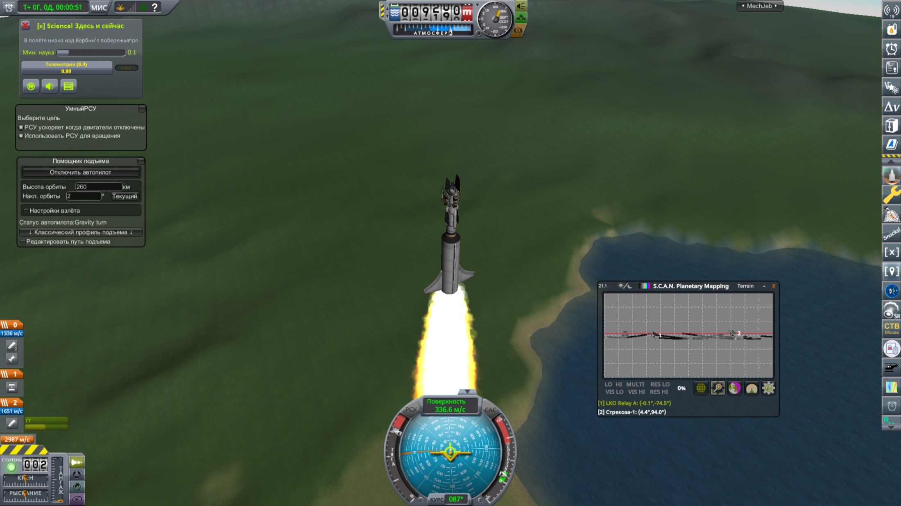

# Скриншоты сборки «Оператор»

Кадры из живой игры на этой сборке — используются в галерее на [kerbal.ru/Operator](https://kerbal.ru/Operator/#screens) и в обзорных документах.

Добавить новый: `tools/add_screenshot.sh <исходник> operator <slug>`, затем дописать запись в `screens.json` и прогнать `python3 tools/gen_gallery.py`. Файл не должен превышать ~500 КБ.

## Ретранслятор на низкой орбите

![Спутник-ретранслятор на орбите Кербина, окна \[x\] Science!, MechJeb и SCANsat](01-lko-relay-orbita.jpg)

«LKO Relay A» на 261 км: развёрнутые панели и ретрансляторы HG-5, окно [x] Science! с готовой к передаче наукой, карта SCANsat поверх рельефа и «Помощник подъёма» MechJeb слева.

`01-lko-relay-orbita.jpg` — 385 КБ

## Ночной пуск под управлением kOS

«Дальняк-1» уходит с побережья: в терминале kOS работает миссия из нашей библиотеки — цель 4758 × 4592 км, наклонение 8,5°, азимут посчитан с поправкой на вращение Кербина. Снизу «1 telnet client attached»: скрипт ведёт внешний агент по сети. В [x] Science! порог передачи 0,1 — нулевую науку не шлём.

`02-kos-telnet-nochnoy-pusk.jpg` — 305 КБ

## Подъём: автопилот, РСУ и картография

Гравитационный разворот над побережьем: «Помощник подъёма» ведёт на 260 км, «УмныйРСУ» экономит монотопливо, SCANsat уже пишет рельеф и держит в списке два аппарата — «LKO Relay A» и «Стрекоза-1». Весь интерфейс модов на русском.

`03-podyom-mechjeb-scansat.jpg` — 328 КБ
